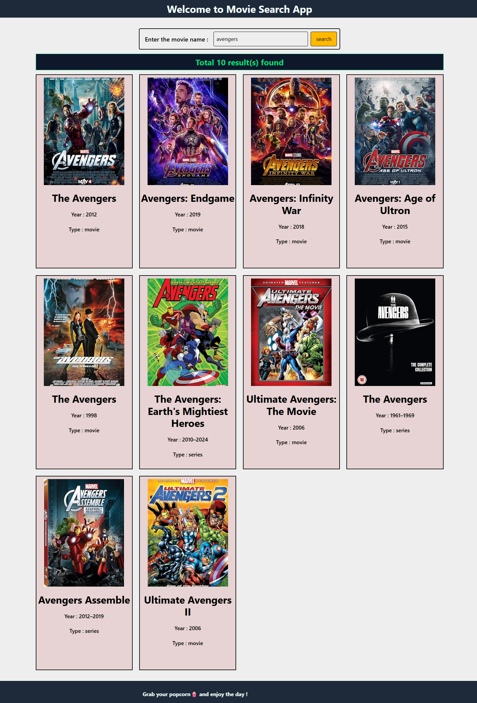

# 🎬 Movie Search App

A simple React + TypeScript + Tailwind CSS project built with Vite.  
This app allows users to search for movies and displays movie details such as title, year, type, and poster.

## 🚀 Features

- 🔍 Search movies by name
- 🎨 Styled with Tailwind CSS
- 📱 Responsive design
- 🖼 Movie posters with details (Title, Year, Type)
- 📜 Fun scrolling footer message

## 🛠️ Tech Stack

- **React 18 + TypeScript**
- **Vite** (for fast bundling)
- **Tailwind CSS** (for styling)
- **Axios** (for fetching data from API)

## ⚡ Getting Started

### 1. Clone the repo

git clone https://github.com/hafeez-07/movie-search-app.git
cd movie-search-app

2. Install dependencies
   npm install
   npm i axios

3. Run locally
   npm run dev
   Your app will be live at http://localhost:5173

📸 Screenshot

🌟 Future Improvements
Pagination for search results
Movie details page
Save favorites

👨‍💻 Author
Made with ❤️ by Hafeez
