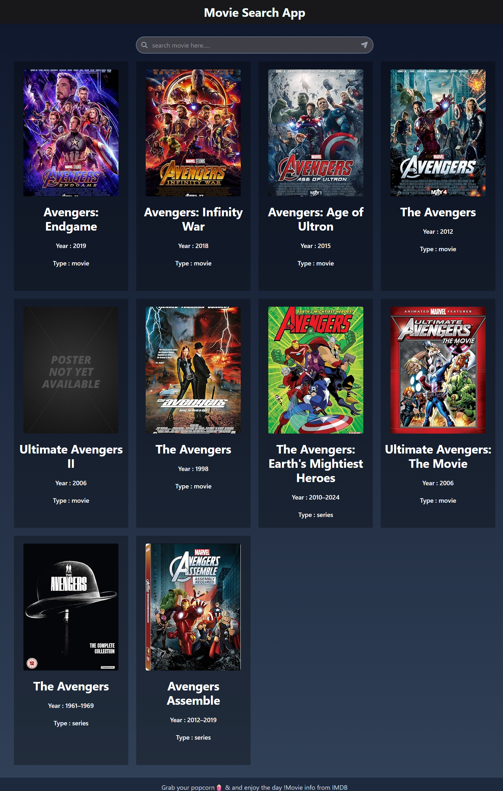

# 🎬 Movie Search App


A modern Movie Search Application built with React, TypeScript, Vite, and Tailwind CSS.

# 🎬 Movie Search App

A modern **Movie Search Application** built with **React, TypeScript, Vite, and Tailwind CSS**.  
Users can search for movies and view details like **title, release year, type, and poster** using the **OMDb API**.

The app focuses on **clean UI, smooth interactions, and good user experience**.

## 🔗 Live Demo

👉 **[View Live App](https://react-movie-search-app-mu.vercel.app)**

## 📸 App Preview



# ✨ Features

### 🔍 Movie Search

- Search movies by title using the **OMDb API**
- Displays **movie poster, title, year, and type**

### 🎨 Modern UI

- Styled with **Tailwind CSS**
- Smooth hover animations on movie cards
- Gradient poster hover overlay (cinematic effect)

### ⚡ Performance & UX

- **Skeleton loading UI** while fetching movies
- **Broken image fallback** for missing posters
- Default poster for `"N/A"` API results

### 💾 Smart Features

- **Last searched movie saved in LocalStorage**
- Automatically loads the last search on refresh

### 📱 Responsive Design

Works smoothly across:

- Desktop
- Tablet
- Mobile devices

# 🛠️ Tech Stack

| Technology       | Purpose                     |
| ---------------- | --------------------------- |
| **React 18**     | UI framework                |
| **TypeScript**   | Type safety                 |
| **Vite**         | Fast development & bundling |
| **Tailwind CSS** | Utility-first styling       |
| **Axios**        | API requests                |
| **OMDb API**     | Movie data                  |

# ⚙️ Installation

### 1️⃣ Clone the Repository

git clone https://github.com/hafeez-07/react-movie-search-app.git
cd react-movie-search-app

### 2 Install Dependencies

npm install
npm install axios

### 3 Add Environment Variable

Create a .env file in the root folder:

VITE_MOVIE_API_KEY=your_omdb_api_key

#### Get your API key from:

👉 https://www.omdbapi.com/apikey.aspx

4️⃣ Run the App
npm run dev

### App will run at:

http://localhost:5173

## 📂 Project Structure

```
src
│
├── components
│ ├── UserInput.tsx
│ ├── MovieData.tsx
│ └── MovieSkeleton.tsx
│
├── assets
│ ├── default_poster.png
│ └── movie_search_app.png
│
├── App.tsx
└── main.tsx
```

### 🧠 Interesting Implementation Details

Poster Fallback Logic

Handles both:

Poster = "N/A"

Broken poster URLs

```
onError={(e) => {
const img = e.currentTarget;
img.onerror = null;
img.src = default_poster;
}}
```
Skeleton Loading UI

While API data loads, skeleton cards appear to improve perceived performance.

Gradient Poster Hover Effect

A cinematic gradient overlay appears when hovering posters, giving the UI more depth and polish.

### 🚀 Future Improvements

🔎 Pagination for large search results

🎬 Movie details page

❤️ Favorite movies feature

⭐ Movie ratings display

🎥 Trailer integration

## 👨‍💻 Author

Made with ❤️ by Hafeez

### GitHub:

https://github.com/hafeez-07
